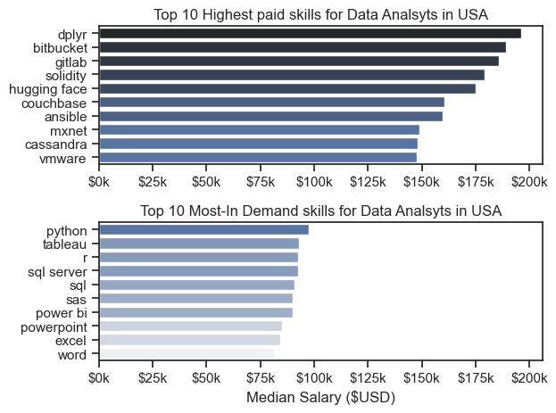

# overview
#### Welcome to my analysis of the data job market,focusing on data analyst roles.This project was created out of a desire to navigate and understand the job market effectively. It delves in to top paying and and in-demand skills to help find optimal job opportunities for data analysts.


# The Questions
#### Below are the questions I want to answer in my project.
1. What are the skills most in demand for top three most popular Data roles?
2. How are in-demand skills trending for Data Analysts?
3. How well do jobs and skills pay for Data Analysts?
4. What are the optimal skills fro Data Analysts to learn(High Demand & High pay)

# Tools I  Used 
For my deep dive in to data analyst job market, I harnessed the power of several key tools.
- python: The Backbone of my analysis,allowing me analyse the data and find critical insights.I also used the following python libraries:
    - Pandas Library: This was used to analysed the data.
    - Matplotlib Library: I visualised using this.
    - Seaborn Library: Helped me create more advanced visuals.

- Jupyter Notebooks: The tools I used to run my python scripts which let me easily include my notes and analysis 
- Visual Studio Code: My go-to for executing my Python scripts.
- Git & GitHUb - Essential for version control 


# The Analysis

## 1. What are the most demanded skills for the top 3 most popular data roles?

To find the most demanded skills for the top 3 most popular data roles,I filtered out those positions by which ones were the most popular and got the top 5 skills for these top 3 roles.This query highlights the most popular job titles and their top skills, showing which skills I should pay attention to depending on the role I'm targeting.

View my notebook with detailed steps here:
[2_skill_demand.ipynb](3_Python_Project/2_Skill_Demand.ipynb)

### Visualise Data 
```
fig, ax = plt.subplots(len(job_titles),1)
for i , job_title in enumerate(job_titles):
     df_plot = df_skills_count[df_skills_count["job_title_short"]==job_title].head(5)   #define a datframe we wan to plot 
     df_plot.plot(kind='barh',x='job_skills',y='skill_count',ax =ax[i],title = job_title)
     ax[i].invert_yaxis()
     ax[i].set_ylabel('')
     ax[i].legend().set_visible(False)
fig.suptitle('Counts of top skills in top postings',fontsize=15)
fig.tight_layout()
plt.show()
```

### Results:


### Insights 
- Python is a versatile skill highly demanded across all the 3 roles, but most prominently for Data Scientists.
- Data Engineer requires more specialised technical skills(AWS,AZURE,Spark) compared to Data Scientists, who are expected to be more proficient in more general data management and analysis tools.

## 2. How are in-demand skills trending for Data Analysts?

### Visualise Data

``` 

sns.lineplot(data = df_plot, dashes = False, palette = 'tab10')
sns.despine()
sns.set_theme(style = 'ticks')

plt.title('Trending top skills for Data Analysts in the USA')
plt.ylabel('Likelihood in Job Posting')
plt.xlabel('')
plt.legend().remove()
plt.legend(loc='upper center', bbox_to_anchor=(0.5, -0.1), ncol=3)
plt.tight_layout(pad=2)

from matplotlib.ticker import PercentFormatter
ax=plt.gca()
ax.yaxis.set_major_formatter(PercentFormatter(decimals=0)) 
```
### Results:


### Insigths:
- Sql remains the most consistently demanded skill throughout the year , although it shows gradual decrease in demand.
- Excel experinced  a significant increase in demand starting around september, surpassing both python and tableu by the end of the year.
- Both python and tableau shows relatively stable demand throughout the year with some fluctuations but remain essential skill for data analyst 

## 3. How well do jobs and skills pay for Data Analysts?

### Salalry analysis for Data Nerds
``` 
sns.boxplot(data=df_us_top6, x='salary_year_avg', y='job_title_short',order = list_job_order)

plt.title("Salary distribution in the USA")
plt.xlabel('Salary Yearly ($USD)')

ax = plt.gca()   #get current axis to cleanuo the bottom axis or any axis
ax.xaxis.set_major_formatter(plt.FuncFormatter(lambda x, pos: f'${int(x/1000)}k'))

plt.xlim(0,600000) #comment out to see the broader aspect 
plt.show()

```
#### Results 

*Box plot visualising the salary distributions for the top 6 data job titles.*
 
 #### Insights
 - There is a significant variation in salary ranges across differernt job titles.Senior Data Engineer positions and Data Scientist tend to have the highest salary potential, with up to $600k, indicating the high value placed on advanced data skills and experience in the industry.
- Data Scientist and Data Engineer roles shows a considerate number of outliers on the higher end of the salary spectrum, suggesting that exceptional skills or circumstances can lead to high in these roles.In contrast, Data Analyst roles demonstrate more consistency in salary , with fewer outliers.
- The median salaries increases with the seniority and specialisations of the roles. 


### Highest Paid and most demanded skills for Data Analyst 
## Visualise Data 
```
fig, ax = plt.subplots(2,1)

sns.barplot(data =df_da_top_pay,x='median',y=df_da_top_pay.index,ax=ax[0],hue='median',palette='dark:b_r' )

sns.barplot(data =df_da_popular_skills,x='median',y=df_da_popular_skills.index,ax=ax[1],hue='median',palette='light:b' )

```
## Results 

*Two seperate Bar graphs visualising the highest Paid and Most in demand skills for Data analyst jobs in USA.*

### Insights 
- The top graph shows specialised skills like dplyr , Bitbucket and gitlab are associated with highest salaries, some reaching up to $200k,suggesting that advanced technical proficiency can increase earning potential.
- The bottom graph highlights that foundational skills like excel,powerpoint and sql are the most in-demand skills , eventhough they may not offer the highest salaries. This demostrates the importance of these core skills for employibility in data analysis roles.
- There's a clear distinction between the skills that are highest paid and that are most in-demand. Data Analsysts aiming to maximise their career potential should consider developing a diverse skill set that includes both high paying specialised skills and widely demanded foundational skills.

## 4. What is the most optimal skill to learn for Data Analysts?

#### Visualise Data 
```
from adjustText import adjust_text

df_da_skills_high_demand.plot(kind ='scatter',x ='skill_percent',y='median_salary')

#prepare the texts for adjusttext
texts =[]
for i, txt in enumerate(df_da_skills_high_demand.index):
    texts.append(plt.text(df_da_skills_high_demand["skill_percent"].iloc[i],df_da_skills_high_demand["median_salary"].iloc[i],txt))
```  

*A Scatter Plot visualising the most optimal skill (high demand and high paying) for data analysts in USA.*

#### Insights
- The scatter plots shows that most of the programming skills  tend to cluster at higher salary  levels compared to other categories, indicating that programming expertise might offer greater salary benefits within data analytics field.
- Analyst tools including tableau and powerbi are prevelant in job postings and offer competitive salaries, showing that visualisation and data analysis software are crucial for data analyst roles
- The database skills such as oracle ans sql server are associated with some of the highest salaries among data analysts tools.
This indicates a significant demand and valuation for data management and manipulation expertise in the industry.